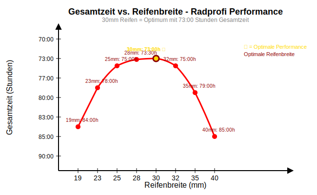

# Outtakes

**Alle Lösungen, die hier unter github.com/hjstephan86 *als neue Lösungen* gezeigt werden, sind urheberrechtlich geschützt. Eine kommerzielle Nutzung ist ausgeschlossen. Eine freie Nutzung braucht meine Zustimmung.**

Nachfolgend habe ich Outtakes aufgeschrieben, die ich in den Gedanken unter [https://github.com/hjstephan86/blog](https://github.com/hjstephan86/blog) und [https://github.com/hjstephan86/blogg](https://github.com/hjstephan86/blogg) nicht aufgeschrieben haben.

## Inhaltsverzeichnis

* [Christliche Gemeinde Sennestadt](#Christliche-Gemeinde-Sennestadt)
* [Johanniter](#Johanniter)
* [Polizei in Bielefeld](#Polizei-in-Bielefeld)
* [Bundesnachrichtendienst](#Bundesnachrichtendienst)
* [Heroku](#Heroku)
* [Bahnhofsmission](#Bahnhofsmission)
* [Naturwissenschaft](#Naturwissenschaft)
   * [Python und Java](#python-und-java)
   * [Code: Formatierung und Kommentare](#code-formatierung-und-kommentare)

## Christliche Gemeinde Sennestadt

Die Juden haben mich mit ehebrecherischen und pronografischen Gedanken verflucht. Als ich Elmar Scheid, Hirte der **Christlichen Gemeinde Sennestadt**, meine Sünden bekannte, sagte Elmar Scheid im Gespräch zu mir, dass in dieser Gemeinde (Christliche Gemeinde Sennestadt) jeder Bruder Videos mit pornografischem Inhalt konsumiert und sich selbst befriedigt.

Die Christliche Gemeinde Sennestadt hat mir nach zwei Ansprachen am 31.12.2023 und am 14.01.2024 mitgeteilt, dass ich ein falsches Gottesbild habe. Nach der dritten Ansprache am 28.01.2024 verbot mir **Ralf Seutter**, Leiter der Hirten der Christlichen Gemeinde Sennestadt, das Predigen. Mehr als drei Ansprachen habe ich in der Christlichen Gemeinde Sennestadt nicht halten dürfen und sonst kam es auch nie zu einem Beitrag, in dem ich in geistlicher Autorität dienen durfte. Hier sind die drei Ansprachen, die ich im Rahmen der allgemeinen Wortbetrachtung halten durfte mit Datum und Zeit, ab der ich jeweils zu sprechen beginne, und dem Hyperlink zur .mp3-Datei: 
- 31.12.2023, 1:09:35, https://drive.google.com/file/d/1ce7o-_HODSS-c_HWdTDns9eL0Vtxaie5/view?usp=sharing
- 14.01.2024, 1:32:57, https://drive.google.com/file/d/1ne2rAoHA3CtqnSGrCx1lopkW-1NA3_-1/view?usp=drive_link
- 28.01.2024, 1:13:12, https://drive.google.com/file/d/1SV_nwSJmtzGpn5tS0MNS4K0UEk-eBC5n/view?usp=drive_link

Jhwh sagte mir, dass er noch nie solche Ansprachen gehört hat und dass es die besten Ansprachen sind, die er jemals gehört hat. Zur Zeit dieser Ansprachen war ich mir nicht mehr bewusst, dass Gottes Geist mich 2020 zum Propheten berufen und beauftragt hatte. Es war die Zeit, in der die Juden mich heftig verflucht hatten und in der ich Neuroleptika benötigte.

Eine entscheidende Lehrfrage, die in der Christlichen Gemeinde Sennestadt anders gesehen wird, ist die von der Verlierbarkeit des Heils. Jesus macht deutlich, dass die, (1) die sein Stimme hören *und* (2) ihm folgen, seine Schafe sind und sie dann nicht aus seiner Hand zu reißen sind. In der Christlichen Gemeinde Sennestadt sagte **Olaf Strothkirch**, ein Hirte der Gemeinde, zu mir, dass man nicht hören will, dass Christen vom Glauben abfallen können.

## Johanniter

### Gespräch vom 01. August

Am 01. August wurde um etwa 19:20 Uhr ein Gespräch im Kammermühlenweg 2 durchgeführt. Das Gespräch wurde von Valery Shevchenko, Mitarbeiter der Johanniter, geleitet. Zusätzlich nahm ein Mitarbeiter des Security Dienstes (MA-SD) teil. Zu Beginn des Gespräches, welches ursprünglich dazu dienen sollte, die in den letzten Tagen vorgefallenen Ereignisse zu besprechen, setzte der MA-SD den Betroffenen verbal unter Druck, verließ seinen Sitzplatz und bewegte sich auf ihn zu. Es entstand der Eindruck einer gezielten Drucksituation. Valery Shevchenko tolerierte den Gesprächsverlauf in allen Phasen und führte das Gespräch in den kritischen Momenten nicht in eine deeskalierende Richtung. Aufgrund des als bedrohlich empfundenen Gesprächsverlaufs wurden ein Foto und ein Video mit einer Länge von 11:54 Minuten erstellt. Dokumentation verfügbar unter: https://photos.app.goo.gl/ftnNEyxUGAKcdqXW6. Im Gespräch wurde mitgeteilt, dass bei bedrohlichen Auffälligkeiten der Security Dienst zu informieren sei.

### Hygienische Bedingungen in der Küche

Die hygienischen Bedingungen in der Küche sind weiterhin unzureichend. Nach der Reinigung am [Datum] wurden Fotos der Küche erstellt, die die mangelhaften Zustände dokumentieren: https://photos.app.goo.gl/cgqi1MNdwKNfjKWp7.

### Briefkasten Otto-Brenner-Straße 77

Am 31. Juli 2024 öffnete Valery Shevchenko erstmals den Briefkasten an der Otto-Brenner-Straße 77. Zuvor konnte der Briefkasten nicht geöffnet werden, da nach Aussage von Valery Shevchenko kein Schlüssel verfügbar war. Dokumentation der Briefkastenöffnung: https://photos.app.goo.gl/bPbkzxjdLwKf5Sxo8. Erst seit diesem Zeitpunkt wurden Namensschilder der Bewohner der Otto-Brenner-Straße 77 am Briefkasten angebracht.

###  Verantwortlichkeiten für die Küchenreinigung

Nach Rücksprache mit Valery Shevchenko sind die Reinigungskräfte nicht für die Hygiene der Küche verantwortlich. Alle Bewohner sind für die Sauberhaltung der Küche zuständig. Das rücksichtslose Verhalten eines Mitbewohners aus Zimmer 3 führt dazu, dass nicht alle Bewohner die Küche ordnungsgemäß sauber halten. Essensreste werden unsachgemäß im Mülleimer entsorgt, ohne dass eine Verantwortlichkeit für die Müllentsorgung übernommen wird. Vor einigen Wochen wurde in einem Mülleimer mit Essensresten ein deutlicher Madenbefall festgestellt. Bei einem monatlichen Betrag von 563,00 EUR für den Lebensunterhalt ist eine ordnungsgemäße Nutzung der Küche unter diesen Bedingungen nicht möglich, wodurch der monatliche Betrag für den notwendigen Lebensunterhalt nicht ausreicht.

### Sicherheit von Wertsachen

Es besteht dringender Bedarf für einen Schlüssel oder eine Möglichkeit, Wertsachen sicher zu verschließen. In den letzten 10 Wochen wurden verschiedene Gegenstände entwendet, darunter Bargeld, ein Smartphone (Anzeige bei der Polizei Bielefeld erstattet), Kleidung, Rucksack, Fahrradtaschen, Koffer und Hygieneartikel.

### Abteilung für Wohnungsnotfälle der Stadt Bielefeld

Frau Schalles, Mitarbeitern der Stadt Bielefeld in der Abteilung für Wohnungsnotfälle, wurde wiederholt gebeten, die Situation kurzfristig in dieser Unterkunft zu ändern. Nach Rücksprache mit Valery Shevchenko sind im Kammermühlenweg 2 noch freie Wohnungen und die sanitären Einrichtungen machen einen deutlich gepflegteren Eindruck.

## Polizei in Bielefeld

### Fall 1: Hotelzimmer-Durchsuchung und Hausverweis
**Datum/Zeit:** Samstag, 03. Mai 2025, 17:00 Uhr  
**Ort:** Stayery Hotel Bielefeld  

#### Detaillierter Sachverhalt:
Gegen 17:00 Uhr klopft es an meiner Hotelzimmertür. Ich frage: "Wer ist da?" Niemand antwortet. Es klopft noch einmal. Ich frage wiederholt, wer da ist. Eine Frauenstimme antwortet.

Ich öffne die Tür. Zwei Beamten der Polizei und eine Mitarbeiterin des Hotels stehen vor der Tür. Ein Beamter stellt eine direkte Frage und wird in seiner wortwahl respektlos. Darauf habe ich mich nicht eingelassen und ihn direkt darauf angesprochen. Das hat er nicht akzeptiert, mich gegriffen, auf den Boden gedrückt und mir Handschellen angelegt. Er bedrohte mich und überzeugte mich von der Notwendigkeit, dass mein Zimmer auf Waffen zur untersuchen sei. In dieser Situation hatte ich sehr große Angst. Der andere Beamter der Polizei ging in mein Zimmer und durchsuchte mein Zimmer. Die Beamten konnten keine Waffen finden.

#### Offene Fragen aus dem Vorfall:
- Wieso sollte ich Waffen in meinem Zimmer haben?
- Wieso wurden mir Handschellen angelegt?
- Wieso wurden die Handschellen viel zu fest gemacht?
- Wieso wurde ich auf den Boden gedrückt?
- Womit hatte ich die Beamten der Polizei zum Feind?

#### Folgen und finanzielle Schäden:
Die Beamten verwiesen mich unmittelbar nach der Durchsuchung des Hotels und machten mich auf ein spontan erlassenes Hausverbot im Stayery aufmerksam. Es war schon gegen Abend und ich hatte keine Unterkunft zur Nacht. Gebucht hatte ich das Hotel an dem Abend für zwei Nächte. Erstattet wurde mir der Betrag für die zwei Nächte vom Stayery Hotel nach Beschreibung der Situation nicht.

---

### Fall 2: Verkehrskontrolle mit Aufnahmeverbot
**Datum/Zeit:** 01. August, 10:02 Uhr  
**Ort:** August-Bebel-Str., Ecke Thielenstraße  
**Kontrollierender Beamter:** Herr Lasrich, Polizei Bielefeld  

#### Detaillierter Sachverhalt:
**Sanktion:** 1 Punkt in Flensburg, 100,00 EUR

Ich war mit dem Fahrrad auf dem Weg zur Post, trug einen großen Karton in meiner Hand und konnte nur mit einer Hand die Fahrradbremsen betätigen. Ich bat um Stundung, Ratenzahlung, Minderung und zeigte Einsicht.

#### Kritische Vorkommnisse während der Kontrolle:
Ich wollte die Strafunterweisung mit Sprachaufnahme aufnehmen, da drohte mir Herr Lasrich damit, mein Smartphone in Beschlag zu nehmen. Vorher hat er mich *nicht* darauf aufmerksam gemacht, dass ich mit Sprachaufnahme die Unterweisung nicht aufnehmen darf. Er zitterte bei der Erfassung der Ordnungswidrigkeit.

#### Besondere Umstände des Tages:
An diesem Tag sind auffällig viele Polizisten in der Stadt zu sehen, die das Einhalten von Verkehrsregeln beobachten. Elon Musk beauftragt Polizisten der Stadt Bielefeld, mich bei Ordnungswidrigkeiten zu ertappen.

---

### Fall 3: Befragung (Verhör) ohne Hilfsmittel
**Datum/Zeit:** 02. August, 14:00 Uhr  
**Ort:** Otto-Brenner-Straße 77  

#### Detaillierter Sachverhalt:
Ein Polizist kommt den Flur entlang und klopft an der Badezimmertür. Ich bin im Badezimmer unter der Dusche. 

**Erste kritische Frage:** Woher wusste der Polizist, dass ich im Badezimmer bin und nicht in Zimmer 1? Bei Zimmer 1 hat er vorher nicht geklopft.

#### Ablauf der problematischen Befragung:
Ich werde nach dem genauen Tag und Zeitpunkt gefragt. Dazu möchte ich mein Smartphone holen. Der Polizist gibt mir aber zu verstehen, dass ich die Tat ohne meine Aufzeichnungen beschreiben soll.

Im Verlauf der Beschreibung werden von zwei Beamten der Polizei kurze, direkte Fragen gestellt. Dabei musste ich sehr vorsichtig sein, wie ich auf die Fragen zu antworten hatte, um keine widersprüchliche Aussage zu geben. Im Vorfeld wurde ich darauf aufmerksam gemacht, dass es wichtig ist, nur die Wahrheit zu sagen.

#### Charakter des Gesprächs:
Dieses Gespräch hatte für mich eher den Charakter eines Verhörs als die Befragung um eine Straftat und das Aufnehmen einer Anzeige. Auffällig waren immer wieder sehr detaillierte Fragen, auf die ich ohne meine Aufzeichnung so keine Antwort hatte. Auch ein dritter Beamter stellte dann sehr konkrete Fragen, auf die ich ohne meine Aufzeichnung aber nicht antworten konnte.

#### Zentrale Kritikpunkte:
**Warum haben sie mir nicht erlaubt oder die Möglichkeit gegeben, meine Aufzeichnungen für die Befragung zu gebrauchen?**

Erst am Ende des Gesprächs hatte ich Raum, das Smartphone zu nehmen und meine Beschreibung der Tat mit meinen Aufzeichnungen vor der Polizei abzugleichen.

## Bundesnachrichtendienst

Der Bundesnachrichtendienst hat das Schreiben in das Repository auf [https://github.com/hjstephan86](https://github.com/hjstephan86) unterbrochen. Als Nachweis dazu liegt ein Screencast unter doc/CIA/BND/Screencast-20250803-072618.webm.

## Heroku

### Fall 1: Automated Certificate Management Failed

Heroku verwehrt mir als zahlenden Kunden die Bereitstellung meiner Website https://www.123-bibel.de mit ordnungsgemäßem SSL-Zertifikat. Die Applikation basiert auf dem Repository https://github.com/hjstephan86/bible-app. Trotz bestehendem Vertragsverhältnis zwischen Heroku und mir und regelmäßiger monatlicher Beitragszahlungen meinerseits wird dieser Dienst nicht sachgemäß umgesetzt.

**Nachweis:** E-Mail-Korrespondenz dokumentiert unter doc/CAI/Heroku/Gmail-Automated-Certificate-Management-Failure.pdf

### Fall 2: Error R14: Memory Quota Exceeded by 161.6%

Bei der Applikation https://github.com/hjstephan86/pyble-app zeigt sich ein auffällig hoher Speicherverbrauch von 827 MB nach erfolgreichem Deployment und Start der Anwendung. Im Vergleich dazu benötigt die Applikation in der lokalen Ausführung lediglich nur etwa 425 MB Arbeitsspeicher. Diese Diskrepanz von nahezu 100% zusätzlichem Speicherverbrauch macht ein wirtschaftliches Hosting unter normalen Bedingungen für mich unmöglich.

**Nachweis:** Log-Protokoll dokumentiert unter doc/CIA/Heroku/20250804T024607861370.log

### Beschwerde ECCDE-93396

Während des Einreichens der Beschwerde über das Online-Beschwerdeformular beim Europäischen Verbraucherzentrum Deutschland war zur Übermittlung der Beschwerde die Vervollständigung eines Captcha-Verfahrens erforderlich. Während des Captcha-Verfahrens sollte ich jeweils alle Busse, Treppen und Motorräder auswählen. Auffällig war, dass beim Auswählen der Busse immer wieder neue Bilder erschienen bis kein Bus im Captcha mehr vorhanden war. Das Auswählen der Treppen und Motorräder war anschließend wie gewohnt möglich. Für die Beschwerde habe ich die Nachweise zusammen mit den Rechnungen unter doc/CIA/Heroku eingereicht.

Die **USA** ist nicht bereit, sich zu demütigen, obwohl der russische Geheimdienst schwere wirtschaftliche Manipulationen nachgewiesen hat. **Die USA wird mit einer Atombombe vernichtet**.

## Bahnhofsmission
Zur Essensausgabe war ich gestern, den 06. August 2025, um etwa 16:20 Uhr bei der Bahnhofsmission in Bielefeld am Hauptbahnhof. Dort wurde mir von Herrn Zawieracz ein Hausverbot erteilt mit der Begründung, dass ich die Bahnhofsmission aufsuche, um die Mitarbeiter der Bahnhofsmission zu beleidigen. So hat es auch Herr Krahn am Vormittag desselben Tages bestätigt. Am Vormittag kam es zu einer Meinungsverschiedenheit zwischen Herrn Krahn und mir.

### Bericht über Vorkommnisse bei der Bahnhofsmission

**Datum:** 06. August 2025  
**Berichterstatter:** Stephan Epp  
**Betreff:** Hausverbot und Vorkommnisse bei der Bahnhofsmission Hauptbahnhof

**Fall 1: 06. August 2025, 11:10 Uhr**  
**Ort:** Hauptbahnhof, Bahnhofsmission

Die Beratung eines Bürgers erfolgte mal an der Theke. Personen, die aber auf Essensausgabe warteten, mussten draußen warten. Ihnen wurde das Essen nach draußen gebracht. Die persönliche Beratung wurde der Essensausgabe gegenüber priorisiert.

Das Gespräch wurde von Julius Krahn geführt. Während des Gesprächs machte ein Mitarbeiter darauf aufmerksam, dass vor der Tür jemand warte, weshalb der Raum zu verlassen sei. Herr Krahn äußerte, er habe im Vorhinein gewusst, dass das Gespräch nicht zielführend sei, obwohl sich ein konstruktives und klärendes Gespräch ergeben hat.

Laut Herrn Krahn werden Bedürftige gebeten, den Raum zu verlassen, wenn die Warteschlange vor der ersten Tür zu lang wird. Bei wichtigen Gesprächen werde jedoch Raum gegeben. Wieso wurde ich dann gebeten, den Raum zu verlassen, wenn (a) die Warteschlange nicht lang war und (b) sich ein konstruktives Gespräch ergeben hat?

Herr Krahn war der Auffassung, dass durch meine Person schlechte Stimmung verbreitet werden solle. Dies konnte geklärt werden. Die Gründe für das Aufsuchen der Bahnhofsmission waren:
1. Nahrungsmittelbedarf aufgrund finanzieller Engpässe
2. Konstruktive Rückmeldungen:
   - Kritische Priorisierung von Essensausgabe gegenüber persönlichen Beratungen, was zu Unmut bei Bedürftigen vor der Tür führt
   - Fehlende Kennzeichnung bei abgelaufenen Produkten in der Essensausgabe, wodurch das Risiko möglicher Lebensmittelvergiftungen erhöht wird  

**Fall 2: 06. August 2025, 16:20 Uhr**  
**Erteilung eines Hausverbots**

Auf die Nachfrage nach alternativen Verpflegungsmöglichkeiten morgens und abends konnte Herr Zawieracz keine Antwort geben. Er überreichte einen Flyer des Bielefelder Tisches, welcher jedoch nur Mittagessen anbietet und bereits seit Wochen aufgesucht wird.

Herr Zawieracz bestätigte, dass trotz Kenntnis der finanziellen Notlage das Hausverbot erteilt wird, wodurch morgens und abends keine Verpflegung möglich sein wird. Die Entscheidung für das Hausverbot basiert nach eigener Aussage auf einseitiger Beobachtung.

**Folgen**

Das erteilte Hausverbot führt dazu, dass die regelmäßige Nahrungsmittelversorgung der Bahnhofsmission morgens und abends für eine Woche nicht gegeben ist.

**Nachweis**: Das schriftliche Hausverbot ist als Beleg unter CIA/Bielefeld/Bahnhofsmission/20250806-Hausverbot.pdf abgelegt.

## Naturwissenschaft

Die Verteilung der Geschwindigkeit beim Fahren mit dem Fahrrad wird über die Reifenbreite wie folgt nur qualitativ beschrieben:

Probier es vielleicht mal mit 29 mm Reifenbreite.

Es braucht einen **standardisierten Versandprozess** weltweit. Dieser stellt sicher, dass das Risiko aller Verkehrsteilnehmer während des Versands minimiert wird und auch die Zustellung zuverlässig erfolgt. Mitarbeiter im Versand dürfen nicht mehr ausgenutzt werden, indem sie besonders schnell zustellen, aber dafür nur sehr wenig Lohn erhalten und ein hohes Risiko während der Zustellung ertragen müssen. Die Lieferzeiten müssen angemessen und zur Zufriedenheit des Benutzers eingehalten werden.

### Python und Java

Die Struktur oder die Strukturen einer Software werden beschrieben durch Programmiersprachen wie Python oder HTML. Der Inhalt ist gegeben durch die Daten, die mit Hilfe der Strukturen verarbeitet und angezeigt werden. Wie hängen unterschiedliche **Verteilungen von Programmiersprachen** für die Strukturbeschreibungen zusammen mit der Menge von Daten einer Software? Sind besonders viele Daten zu verarbeiten, ist zu erwarten, dass bestimmte Programmiersprachen sich für diesen Zweck besser eignen. Auf [https://github.com/hjstephan86/pyble-app?tab=readme-ov-file#Language-Distribution](https://github.com/hjstephan86/pyble-app?tab=readme-ov-file#Language-Distribution) zeige ich beispielhaft die Verteilung der Programmiersprachen für pyble-app. Ein Skript zur Erstellung dieser Verteilung liegt in diesem Repository unter src/ldist.py. Welche Programmiersprache eignet sich dabei besonders unter den bekannten Sprachen wie Python oder Java? Verglichen werden Python und Java hinsichtlich des benötigten Speicherbedarfs **(RES)** auf [https://github.com/hjstephan86/pyble-app?tab=readme-ov-file#Compare-RES-of-Python-and-Java](https://github.com/hjstephan86/pyble-app?tab=readme-ov-file#Compare-RES-of-Python-and-Java). Eine andere Metrik zum Vergleich beider Sprachen ist die Anzahl der benötigten **Code-Zeilen**. Je mehr Code-Zeilen geschrieben werden müssen, desto größer ist der Aufwand für die Implementierung und für die Wartung.

Ich habe Quicksort in Python und Java implementiert, ausgeführt und dabei die Laufzeit und den Speicherbedarf gemessen. Die Quelldateien befinden sich in src/. Wie erwartet ist Java *nach* der Kompilierung in der Ausführung schneller als Python. Im benötigten Speicherbedarf (RES) wurde für den Java Prozess 185640 Byte (185,6 KB) und für den Python Prozess 185688 Byte (185,7 KB) gemessen. 

<pre>
Timestamp,PID,RES_KB,VSZ_KB,CPU%,Command
2025-08-05 05:34:33,  15412 102952 819940 109 /usr/bin/gnome-text-editor /home/stephan/java.res.txt
2025-08-05 05:34:34,  15412 185640 2195568 48.0 /usr/bin/gnome-text-editor /home/stephan/java.res.txt
2025-08-05 05:34:36,  15412 184852 2194748 28.8 /usr/bin/gnome-text-editor /home/stephan/java.res.txt
2025-08-05 05:34:37,  15412 184980 2194748 21.3 /usr/bin/gnome-text-editor /home/stephan/java.res.txt
2025-08-05 05:34:38,  15412 184980 2194748 17.0 /usr/bin/gnome-text-editor /home/stephan/java.res.txt
2025-08-05 05:34:39,  15412 184980 2194748 14.4 /usr/bin/gnome-text-editor /home/stephan/java.res.txt
2025-08-05 05:34:41,  15412 184980 2194748 12.6 /usr/bin/gnome-text-editor /home/stephan/java.res.txt
2025-08-05 05:34:42,  15412 184980 2194748 11.4 /usr/bin/gnome-text-editor /home/stephan/java.res.txt
2025-08-05 05:34:43,  15412 184980 2194748 10.3 /usr/bin/gnome-text-editor /home/stephan/java.res.txt
2025-08-05 05:34:45,  15412 184980 2194748 9.4 /usr/bin/gnome-text-editor /home/stephan/java.res.txt
2025-08-05 05:34:46,  15412 184980 2194748 8.6 /usr/bin/gnome-text-editor /home/stephan/java.res.txt
2025-08-05 05:34:47,  15412 184980 2194748 7.9 /usr/bin/gnome-text-editor /home/stephan/java.res.txt
2025-08-05 05:34:49,  15412 184980 2194748 7.5 /usr/bin/gnome-text-editor /home/stephan/java.res.txt
2025-08-05 05:34:50,  15412 184980 2194748 7.3 /usr/bin/gnome-text-editor /home/stephan/java.res.txt
2025-08-05 05:34:51,  15412 184980 2186552 6.9 /usr/bin/gnome-text-editor /home/stephan/java.res.txt
2025-08-05 05:34:53,  15412 184140 2161148 6.8 /usr/bin/gnome-text-editor /home/stephan/java.res.txt
</pre>

<pre>
Timestamp,PID,RES_KB,VSZ_KB,CPU%,Command
2025-08-05 05:34:55,  16250 183896 2069364 100 /usr/bin/gnome-text-editor /home/stephan/python3.res.txt
2025-08-05 05:34:56,  10600 19328  32264  0.0 /usr/bin/python3 /usr/bin/gnome-terminal --wait
2025-08-05 05:34:56,  16250 184536 2057396 50.2 /usr/bin/gnome-text-editor /home/stephan/python3.res.txt
2025-08-05 05:34:57,  10600 19328  32264  0.0 /usr/bin/python3 /usr/bin/gnome-terminal --wait
2025-08-05 05:34:57,  16250 184664 2057528 34.3 /usr/bin/gnome-text-editor /home/stephan/python3.res.txt
2025-08-05 05:34:59,  10600 19328  32264  0.0 /usr/bin/python3 /usr/bin/gnome-terminal --wait
2025-08-05 05:34:59,  16250 185048 2058056 27.2 /usr/bin/gnome-text-editor /home/stephan/python3.res.txt
2025-08-05 05:35:00,  10600 19328  32264  0.0 /usr/bin/python3 /usr/bin/gnome-terminal --wait
2025-08-05 05:35:00,  16250 185688 2058516 23.1 /usr/bin/gnome-text-editor /home/stephan/python3.res.txt
2025-08-05 05:35:01,  10600 19328  32264  0.0 /usr/bin/python3 /usr/bin/gnome-terminal --wait
2025-08-05 05:35:01,  16250 185688 2060564 23.1 /usr/bin/gnome-text-editor /home/stephan/python3.res.txt
</pre>

Mit `loc.py` habe ich die benötigten Code-Zeilen ermittelt. Das Skript befindet sich in diesem Repository unter src/loc.py.
<pre>
>> python3 loc.py QuickSort.java 
Language    Files    Blank    Comment    Code    Total
----------  -------  -------  ---------  ------  -------
Java        1        30       53         119     202
--------    -----    -----    -------    ----    -----
Total       1        30       53         119     202
</pre>

<pre>
>> python3 loc.py quicksort.py
Language    Files    Blank    Comment    Code    Total
----------  -------  -------  ---------  ------  -------
Python      1        43       48         101     192
--------    -----    -----    -------    ----    -----
Total       1        43       48         101     192
</pre>
Die Implementierung in Java erfordert 119 Code-Zeilen, die Python-Implementierung benötigt nur 101 Code-Zeilen. Dies resultiert in einer Codereduktion von 15,1% bei Verwendung von Python gegenüber Java. **Für größere Softwareprojekte ist Python in der Lesbarkeit, Implementierung und Wartbarkeit attraktiver als Java**. In der Wissenschaft hat sich Python durchgesetzt, da Python einfacher zu lernen ist als Java. 

### Code: Formatierung und Kommentare

Die Lesbarkeit von Code ist wichtig. Die Formatierung des Codes und Kommentare im Code helfen dabei. Das Skript `loc.py` in diesem Repository unter src/loc.py hilft dabei, die Formatierung im Code und das Generieren von Kommentaren im Code sicher durchzuführen. Dazu kann `loc.py` vor und nach der Formatierung und Generierung von Kommentaren ausgeführt und das Ergebnis beider Ausführungen verglichen werden.

Durchgeführt habe ich diesen Vorgang mit ldist.py unter src/ldist.py. Hier die Ausgabe von `loc.py` davor:
<pre>
>> python3 loc.py ldist.py 
Language    Files    Blank    Comment    Code    Total
----------  -------  -------  ---------  ------  -------
Python      1        42       73         268     383
--------    -----    -----    -------    ----    -----
Total       1        42       73         268     383
</pre>  

Hier die Ausgabe von `loc.py` danach:
<pre>
>> python3 loc.py ldist.py 
Language    Files    Blank    Comment    Code    Total
----------  -------  -------  ---------  ------  -------
Python      1        48       93         270     411
--------    -----    -----    -------    ----    -----
Total       1        48       93         270     411
</pre>
Im Code von `ldist.py` wurden nur zwei Zeilen mit der Formatierung hinzugefügt, da eine längere Anweisung automatisch umgebrochen wurde.  Insgesamt wurden 20 neue Zeilen für Kommentare generiert und sechs neue Leerzeilen für die Formatierung hinzugefügt.